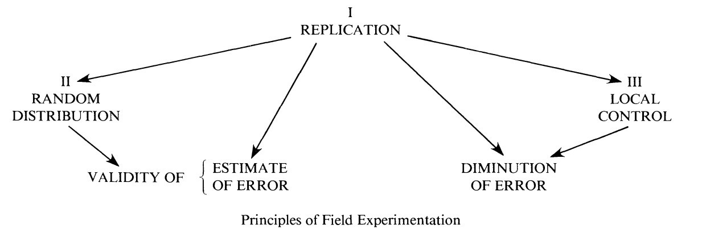
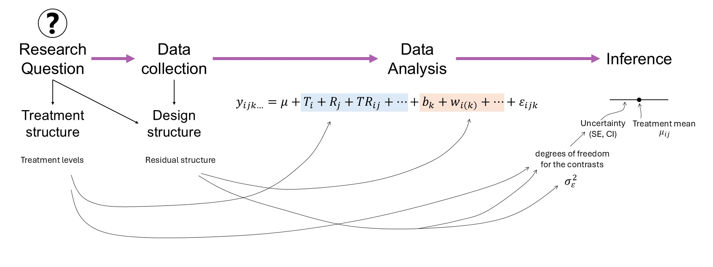
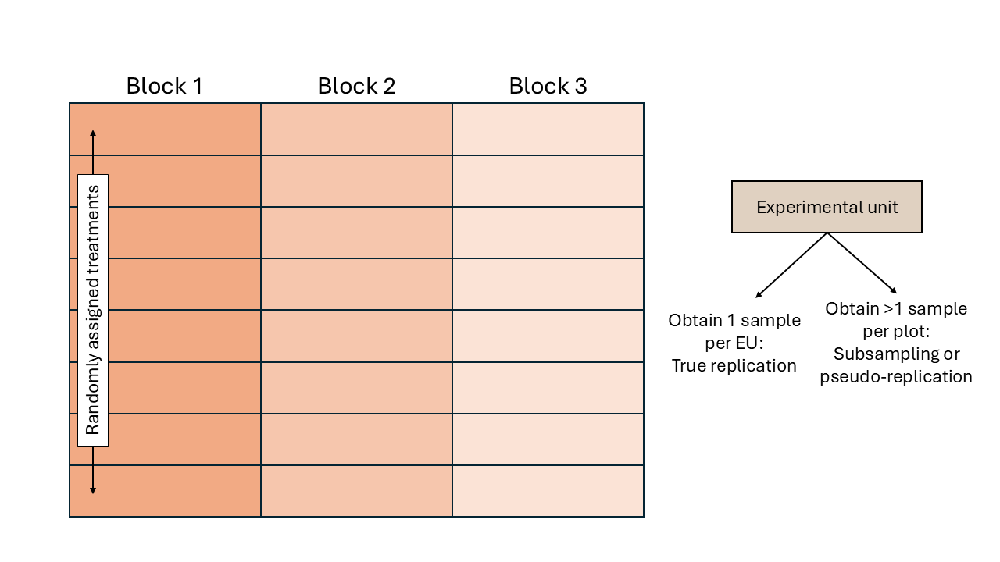

# Welcome to the Design of Experiments Workshop!


## Overview   

**Review of designed experiments**  

- Why do we need designed experiments? 
- Precision, power, and inference 
- Optimal designs 

**TAPS designed experiments**  

- TAPS designs 
- Integrating new questions into TAPS experiments 


::: {.callout-tip}
### Some review of math and notation

**On Notation:**

- scalars: $y$, $\sigma$, $\beta_0$  
- vectors: $\mathbf{y} \equiv [y_1, y_2, ..., y_n]'$, $\boldsymbol{\beta} \equiv [\beta_1, \beta_2, ..., \beta_p]'$, $\boldsymbol{u}$  
- matrices: $\mathbf{X}$, $\Sigma$  
- probability distribution: $y \sim N(0, \sigma^2)$, $\mathbf{y} \sim N(\boldsymbol{0}, \sigma^2\mathbf{I})$.     

**On Stat models** 

Typically we write $\mathbf{y} = \mathbf{X}\boldsymbol{\beta} + \boldsymbol\varepsilon$. 

- Here, $\mathbf{y}$ is the vector of the response data, $\mathbf{X}$ is the design matrix with the predictors, and $\boldsymbol{\beta}$ is a vector with the effects of those predictors. 
- The residuals are typically $\varepsilon_i \sim N(0, \sigma^2)$. 
- You will see $\mathbf{X}^\top \mathbf{X}$ a lot because it is related to the estimation of $\sigma^2$ and thus, affects all inference. What does it do?
  The result is a square matrix where the number of rows and columns equals the number of predictors (i.e., treatments).
  - The diagonal indicates the sum of squares of that predictor. 
  - The off-diagonal are unscaled versions of correlations between predictors. 

:::


--------------------------

## Why do we need designed experiments?   

- Golden rules: replication, randomization, local control 

```{r echo=FALSE, out.width= "60%", fig.align='center', fig.cap="Fisher's diagram 'The Principles of Field Experimentation'. Figure 1 in [Preece (1990)](https://doi.org/10.2307/2532438)"}

```

- And why do we need statistics to analyze our experiment results?  
- History of designed experiments [[link](https://www.jstor.org/stable/48736885?seq=5)] 
- History of statistics [[link](https://www.amazon.com/Lady-Tasting-Tea-Statistics-Revolutionized/dp/0805071342)] 

## Precision, power, and inference 

The most common model we use can be generally described as 

$$y_{i} \sim N(\mu_i, \sigma^2),$$
where $y_{i}$ is the $i$th observation with expected value $\mu_i$ and variance $\sigma^2$. Generally speaking, we can say $\boldsymbol\mu = \mathbf{X} \boldsymbol{\beta}$, where $\mathbf{X}$ is the design matrix (i.e., contains info on all treatments, etc) and $\boldsymbol{\beta}$ is a vector containing all parameters. 

The assumptions we make are 

- normality,
- independence,
- constant variance.

A few properties arise as a consequence:

- $\hat{\boldsymbol{\beta}}$ is an unbiased estimator of $\boldsymbol{\beta}$
- $\hat{\boldsymbol{\beta}}$ is also the unbiased estimator with the smallest variance. 
- Precision of the estimates: $Var(\hat{\boldsymbol{\beta}}) = \frac{\sigma^2}{\mathbf{X}^\top \mathbf{X}}$
- Standard error of the estimates: $se(\hat{\boldsymbol{\beta}}) = \sqrt{\frac{\sigma^2}{\mathbf{X}^\top \mathbf{X}}}$
- Also, looking directly at treatment means $\mu_j$: $se(\hat{\mu_j}) =\sqrt\frac{\sigma^2}{r}$, where $r$ is the number of repetitions. 
- Variance of $\hat{y}$: $Var(\hat{y}) = \sigma^2 \mathbf{X} (\mathbf{X}^\top \mathbf{X})^{-1} \mathbf{X}^\top$  
- See 'Review' above to understand what $\mathbf{X}^\top \mathbf{X}$ does. 

#### Inference 

- What in the model were we interested about? 
- A confidence interval of $\hat{\boldsymbol{\beta}}$: $CI_{95\%\ \hat{\boldsymbol{\beta}}} = \hat{\boldsymbol{\beta}} \pm t_{1-\alpha/2, df} \cdot se(\hat{\boldsymbol{\beta}})$ 
- What is the most accurate confidence interval? 
- What is the best confidence interval?

```{r echo=FALSE, out.width= "90%", fig.align='center', fig.cap="Mindmap: experiment design and data analysis in the context of a research question."}

```


#### Precision  

We wish to maximize the information about the estimates: this means having a narrow range of values where we have high confidence contain the true value.  

Recall:

$$CI_{95\%\ \hat{\beta_j}} = \hat{\beta_j} \pm t_{1-\alpha/2, df} \cdot se(\hat{\beta_j}).$$ 

**What happens when we increase the number of observations:**

- $t_{1-\alpha/2,\ df_1} \rightarrow t_{1-\alpha/2,\ df_2}$
- $se(\hat{\beta_j}) = \sqrt{\frac{\sigma^2}{(\mathbf{X}^\top \mathbf{X})^{-1}_{jj}}} = \sqrt{\frac{\sigma^2}{n\cdot s^2_x}}$ 
- Discuss increasing $r$ versus increasing $J$ (i.e., total number of treatments). 

#### Power 

- Statistical power is directly connected to hypothesis tests. 
- Hypothesis tests are directly connected to the standard error of the estimates. 

**Strategies to increase power**

Elements of ANOVA 

<head>
    <meta charset="UTF-8">
    <meta name="viewport" content="width=device-width, initial-scale=1.0">
    <title>ANOVA table for the cookie split-plot experiment.</title>
    <style>
        table {
            width: 100%;
            border-collapse: collapse;
            margin: 20px 0;
        }
        th, td {
            border: 1px solid #ddd;
            padding: 8px;
            text-align: left;
        }
        th {
            background-color: #f4f4f4;
            font-weight: bold;
        }
        tr:nth-child(even) {
            background-color: #f9f9f9;
        }
    </style>
</head>

<body>

<table>
    <tr>
        <th>Source</th>
        <th>df</th>
        <th>SS</th>
        <th>MS</th>
        <th>EMS</th>
    </tr>
    <tr>
        <td>Block</td>
        <td>$b-1$</td>
        <td> </td>
        <td> </td>
        <td>$$\sigma^2_{\varepsilon}+g\sigma^2_w+tg\sigma^2_d$$</td>
    </tr>
    <tr>
        <td>Fungicide</td>
        <td>$t-1$</td>
        <td>$SS_{F}$</td>
        <td>$\frac{SS_{F}}{b-1}$</td>
        <td>$$\sigma^2_{\varepsilon}+g\sigma^2_w+\phi^2(\alpha)$$</td>
    </tr>
    <tr>
        <td>Error(whole plot)</td>
        <td>$(b-1)(t-1)$</td>
        <td> </td>
        <td> </td>
        <td>$$\sigma^2_{\varepsilon}+g\sigma^2_w$$</td>
    </tr>
    <tr>
        <td>Genotype</td>
        <td>$g-1$</td>
        <td>$SS_{G}$</td>
        <td>$\frac{SS_{G}}{g-1}$</td>
        <td>$$\sigma^2_{\varepsilon}+\phi^2(\gamma)$$</td>
    </tr>
    <tr>
        <td>$T \times G$</td>
        <td>$(t-1)(g-1)$</td>
        <td>$SS_{F \times G}$</td>
        <td>$\frac{SS_{F \times G}}{(t-1)(g-1)}$</td>
        <td>$$\sigma^2_{\varepsilon}+\phi^2(\alpha \gamma)$$</td>
    </tr>
    <tr>
        <td>Error(split plot)</td>
        <td>$t(b-1)(g-1)$</td>
        <td>$SSE$</td>
        <td>$\frac{SSE}{t(b-1)(g-1)}$</td>
        <td>$$\sigma^2_{\varepsilon}$$</td>
    </tr>

</table>
</body>


```{r}
#| echo: false

set.seed(4)
n <- 3
groups <- c("A", "B", "C")
data_low_n <- data.frame(
  treatment = rep(groups, each = n),
  value = c(rnorm(n, 10, 2), rnorm(n, 10, 2), rnorm(n, 13.5, 2))
)

anova_baseline <- aov(value ~ treatment, data = data_low_n)
knitr::kable(summary(anova_baseline)[[1]], 
             caption = "Baseline: Low #reps (3), Low #trts (3)")

set.seed(2)
n <- 7
groups <- c("A", "B", "C")
data_low_n <- data.frame(
  treatment = rep(groups, each = n),
  value = c(rnorm(n, 10, 2), rnorm(n, 10, 2), rnorm(n, 13.5, 2))
)

anova_baseline <- aov(value ~ treatment, data = data_low_n)
knitr::kable(summary(anova_baseline)[[1]], 
             caption = "Baseline: More #reps (6), Low #trts (3)")


set.seed(88)
n <- 3
groups <- c("A", "B", "C", "D", "E", "F", "G")
data_low_n <- data.frame(
  treatment = rep(groups, each = n),
  value = c(rnorm(n, 10, 2), rnorm(n, 10, 2), rnorm(n, 10, 2), 
             rnorm(n, 10, 2), 
            rnorm(n, 10, 2), rnorm(n, 10, 2), rnorm(n, 13.5, 2))
)

anova_baseline <- aov(value ~ treatment, data = data_low_n)
knitr::kable(summary(anova_baseline)[[1]], 
             caption = "Baseline: Low #reps (3), More #trts (6)")

```

### Blocks 

Blocks (or local control) are included to increase precision --> increase power. 

- How are blocks applied nowadays? 
- What does 'convenience blocking' generate? See [Stroup (2002)](https://link.springer.com/article/10.1198/108571102780).  

**Incomplete Block Designs**

- More likely to recover spatial variability because they're smaller. 
- `ibd` R package [[link](https://cran.r-project.org/web/packages/ibd/index.html)]

## Optimal designs 

Considering the items above, we can confidently say that **our design affects** $\mathbf{X}$ **and thus, precision, power, and inference.** 

There is a big body of literature studying the different designs that optimize different outcomes (e.g., precision, power, inference, etc.).

Optimality criteria summarize how good a design is in a single number. Optimal designs just optimize those criteria. 

### Some optimality criteria with emphasis on estimation 

**D-optimality** 

- Perhaps the most common in field experiments.  
- Emphasis on the quality of the parameter estimates. 
- Minimize $({\mathbf{X}^\top \mathbf{X}})^{-1}$ (i.e., maximize the determinant of the information matrix ${\mathbf{X}^\top \mathbf{X}}$). 
- Maximizes the differential Shannon information content of the parameter estimates. 

**C-optimality** 

- Minimizes the variance of a predetermined linear combination of parameters. 


### Other interesting optimality criteria with emphasis on prediction 

**G-optimality** 
- Minimizes the maximum variance of the predicted values across the design region. 
**I-optimality** 
- Minimizes the average prediction variance over the design region. 

## TAPS designed experiments

Designed experiments in TAPS are typically arranged in a randomized complete block design (RCBD). 


```{r echo=FALSE, out.width= "60%", fig.align='center', fig.cap="Schematic representation of a randomized complete block design."}

```

Some TAPS designed experiments are arranged in a split-plot design. 

```{r echo=FALSE, out.width= "60%", fig.align='center', fig.cap="Schematic representation of a split-plot design randomized complete block arrangement."}
knitr::include_graphics("figures/designs_splitplot.PNG")
```


### In rounds: 

- What is one benefit we get from TAPS designs? 
- What are the treaments in TAPS experiments? 


