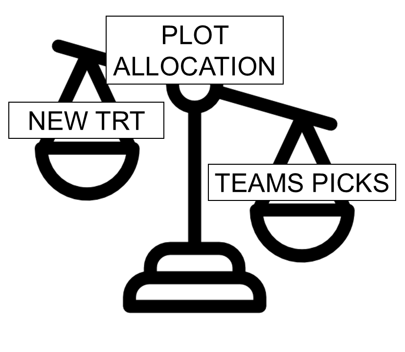

# TAPS - some learning

## What is special about TAPS designs?

Designed experiments in TAPS are typically arranged in a randomized complete block design (RCBD).

```{r echo=FALSE, out.width= "60%", fig.align='center', fig.cap="Schematic representation of a randomized complete block design."}
knitr::include_graphics("figures/designs_rcbd.PNG")
```

Some TAPS designed experiments are arranged in a split-plot design.

```{r echo=FALSE, out.width= "60%", fig.align='center', fig.cap="Schematic representation of a split-plot design randomized complete block arrangement."}
knitr::include_graphics("figures/designs_splitplot.PNG")
```

-   Designs are D-Optimal - best to estimate the team's yield/profit precisely.

```{r echo=FALSE, out.width= "30%", fig.align='center', fig.cap="Prioritizing our research questions often seems like a balancing act between resources allocated to the competition, and resources allocated to additional research."}

```

## An applied example

A manager is designing a competition with 24 teams signed up, and needs to decide whether to use 4 replicates or 3 replicates and allocate more resources to the research question.

**Some questions:**

-   What is the trade-off between #reps and #points?
-   How do we assign the new treatments?

Consider the following options:

```{r}
#| echo: false
des_options <- data.frame(
  "Teams" = 24,
  "Reps per team" = c(4, 3, 2),
  "Plots assigned to other treatments" = 
    c("12 + 48", "12 + 24", "12"),
  "Total plots available" = 108
)
knitr::kable(des_options, 
             col.names = c("# Teams", 
                    "# Reps per team", 
                    "# Plots assigned to other treatments", 
                    "Total plots available"),
             align = "cccc",
             caption = "Design Options")
```

**Mathematically, we can infer a few points:**

-   Recall that $se(\hat{\mu_j}) =\sqrt\frac{\sigma^2}{r}$.
-   Assume $\sigma^2 = 20$ and we get:

```{r}
#| echo: false
des_options <- data.frame(
  "Teams" = 24,
  "Reps per team" = c(4, 3, 2),
  "Plots assigned to other treatments" = 
    c("12 + 48", "12 + 24", "12"),
  "SE(Teams mean)" = c("sigma2/sqrt(4) = 0.5 sigma", 
                       "sigma2/sqrt(3) = 0.58 sigma", 
                       "sigma2/sqrt(2) = 0.71 sigma")
  )
knitr::kable(des_options, 
             col.names = c("# Teams", 
                    "# Reps per team", 
                    "# Plots assigned to other treatments", 
                    "SE(Teams mean)"),
             align = "cccc",
             caption = "SE of the team's means for the different design options")
```

**How are the estimates of N and Irr affected?**

-   Recall that $se(\hat{\boldsymbol\beta}) =\sqrt{\sigma^2 (\mathbf{X}^\top\mathbf{X})^{-1}}$ and thus $se(\hat{\beta_j}) =\sqrt{\sigma^2 (\mathbf{X}^\top\mathbf{X})^{-1}_{jj}}$.

Essentially,

$$se(\hat\beta_j) = \sqrt{\sigma^2 (r\mathbf{X}_{teams}^\top \mathbf{X}_{teams} + \mathbf{X}_{extra}^\top \mathbf{X}_{extra})^{-1}}$$

### Camparing designs side by side

```{r}
# table
```

```{r}
#figures 
```

## Planning Colby 2026

An applied scenario.

[Get R code]().
